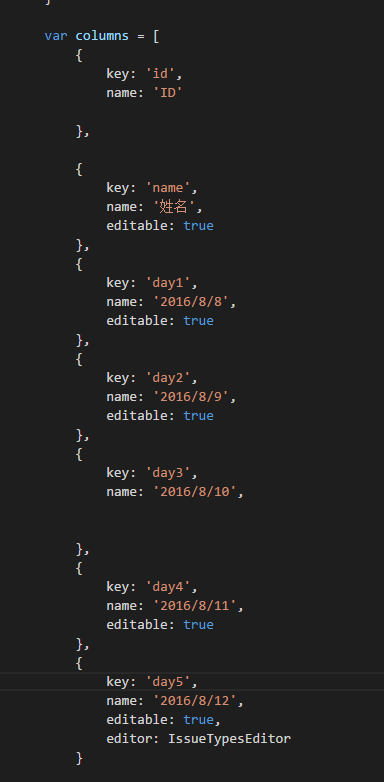
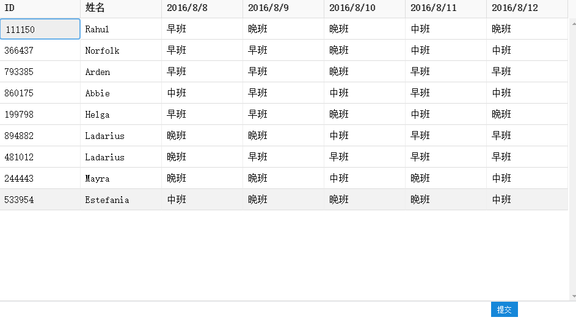
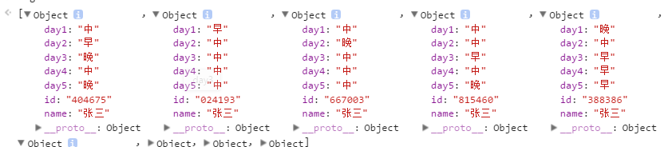

# excel-demo
基于[react-data-grid](https://github.com/adazzle/react-data-grid)的开发的类excel demo

##用法
 > npm install 
   npm start

## 特性
>   * 可调整、冻结列宽
    * 单元格可编辑
    * 格式化单元格数据
    * 编辑单元格时可加入单词联想
    * 单元格排序
    * 单元格词过滤
    * 可支持大量数据
    * 重写航渲染样式
    * 单元格纵向拖拽复制
    * 行选择
    * 单元格-鼠标键盘事件
    * 锁定表头
    * 分组浏览
    * 自定义过滤器

## 常用参数
> * columns
        - key:'id'
        - name:'ID'
        - resizable:true(允许拖拽宽度)
        - locked:true(冻结列，水平滚动是锁定)
## 参数配置

##　demo 

## 提交数据格式

